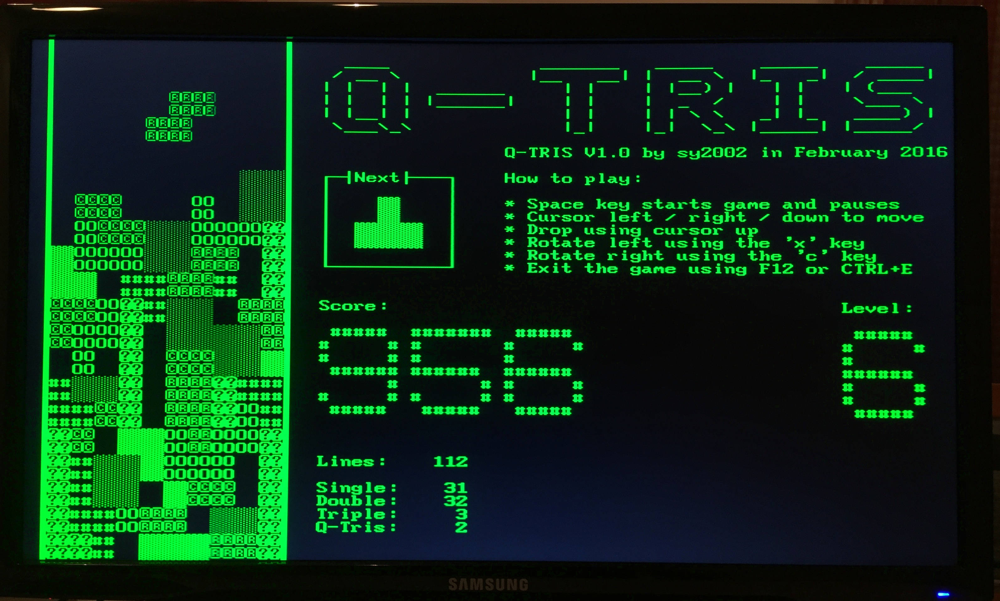

QNICE-FPGA  16-bit System-on-a-Chip
===================================


What is QNICE-FPGA?
-------------------

QNICE-FPGA is a 16-bit computer system build as a fully-fledged
system-on-a-chip in portable VHDL on a FPGA. Specifications:

* 16-bit QNICE CPU featuring 16 registers, 8 of them in 256 register banks
  (learn more in [qnice_intro.pdf](doc/intro/qnice_intro.pdf))
* 32k words ROM (64kB)
* 32k words RAM (64kB)
* UART 115.200 baud, 8-N-1, CTS
* VGA 80x40 character textmode display (640x480 resolution)
* PS/2 keyboard support (mapped to USB on the Nexys 4 DDR)
* SD Card and FAT32 support (microSD card on the Nexys 4 DDR)
* 4-digit 7-segment display
* 16 hardware toggle switches

The main purpose of QNICE-FPGA is learning, teaching and having fun.

Getting Started
---------------

If you do have FPGA hardware, then read on to learn how to get started. If
you don't, then you might want to use the emulator to experience QNICE:
[Try it online](https://qnice-fpga.com/emulator.html) or have a look at
[emulator/README.md](emulator/README.md) to learn how to build and run your
own emulator.

Get started using actual FPGA hardware:

* Clone GitHub repo: Make sure you have `git` installed on your computer,
  open a Terminal or Command Line. We will automatically create a subdirectory
  called QNICE-FPGA, so navigate to an appropriate folder. Use this command
  to clone the `master` branch of QNICE-FPGA, as the `master` branch always
  contains the latest stable version:
  `git clone https://github.com/sy2002/QNICE-FPGA.git`
  (Hint: It is important, that you clone the repository instead of just
  downloading it as a ZIP. The reason is, that some build scripts rely on
  the fact, that there is an underlying git repository.)

* Hardware: Currently, we develop QNICE-FPGA on a Nexys 4 DDR development
  board. Nexys updated and renamed it to Nexys A7.
  So, if you own one of those, the fastest way of getting started is to
  download the bitstream file `dist_kit/qnice-v141.bit` on a microSD card or
  a USB stick, insert it into the Nexys board and set the jumpers to read the
  FPGA configuration from the SD card or USB stick. Do not copy more than one
  `*.bit` file on the SD card, i.e. do not copy `dist_kit/q-tris.bit`, yet.
  Do empty the "Recycle Bin" or similar of your host OS between two `*.bit`
  copies, so that the Nexys board does not accidentally read the `*.bit` from
  your trash instead of the recent one.

* If you do not own a Nexys 4 DDR or A7 board or if you want to synthesize
  the FPGA configuration bitstream by yourself, then go to the hardware
  folder `hw`. It contains the FPGA, board and toolchain (IDE) specific files.
  QNICE-FPGA has been designed to be portable. Have a look at
  [hw/README.md](hw/README.md) to learn more.

* Attach an "old" USB keyboard supporting boot mode to the board and attach
  a VGA monitor. Attach the USB cable to your desktop computer, so that you
  can setup a serial (terminal) connection between the desktop and the FPGA.
  (The file `doc/constraints.txt` contains a list of known-to-work USB
  keyboards.)

* On your host computer: Open a command line and head to the root folder of
  the QNICE-FPGA GIT repository.

* Compile the toolchain: You need to have the GNU compiler toolchain
  installed, particularly `gcc` and `make` will be used. Open a terminal in
  the QNICE root folder. Enter the following (it is important, that you `cd`
  into the folder):
  ```
  cd tools
  ./make-toolchain.sh
  ```
  You will be asked several questions. Answer them using the default answers
  by pressing `Enter` instead of answering manually by choosing `y` or `n`.
  When done, `cd ..` back to the QNICE root folder.

* Compile the mandelbrot demo by entering
  `assembler/asm demos/mandel.asm`.

* On macOS, you now have an ASCII file in the clipboard/pasteboard that starts
  with the line `0xA000 0x0F80`. On other operating systems, you might see an
  error message, stating that `pbcopy` is not available. You can savely
  ignore this and manually copy the file `demos/mandel.out` into your
  clipboard/pasteboard.

* Open a serial terminal program, configure it as 115.200 baud, 8-N-1, CTS ON,
  attach the QNICE-FPGA, turn it on, after the bitstream loaded from the SD
  card, connect the terminal program to the serial interface of the FPGA and
  press the reset button. You should see a welcome message and the `QMON>`
  prompt in your terminal program's window.

* Enter `M` then `L` there. You should see something like "Memory/Load".

* Paste the `demos/mandel.out` file to your terminal program's window.
  Alternatively, some terminal programs offer a "Send File" command.
  (If you are using CoolTerm: Please do paste by using CTRL+V on Windows or
  on a Mac by using CMD+V, because using the "Paste" menu command that is
  available via the context menu is not always working properly, when it
  comes to sending data.)

* Press CTRL+E to leave the memory loading routine.

* Enter `C` then `R` and then `A000` in the terminal window. You should
  now see a Mandelbrot output similar to the above-mentioned screenshot in
  your serial terminal window.

* Now set the toggle switches #0 and #1 to '1' (on the Nexys 4 DDR board,
  these are the two rightmost switches). Press the reset button. STDIN/STDOUT
  are now routed from the serial terminal to the PS2/USB keyboard and to
  the VGA screen.

* A reset does not clear the memory, so enter `C` and then `R` and then
  `A000` again. Done! You now should see the same mandelbrot on your
  VGA screen as shown in the above-mentioned screenshot. Use cursor keys
  and page up/down keys to scroll.

Using the File System
---------------------

* QNICE-FPGA supports SD Cards (microSD Cards on the Nexys 4 DDR), that are
  formatted using FAT32. Make sure that you read the file
  [doc/constraints.txt](doc/constraints.txt) to understand what works and what
  does not.

* Copy the folder `qbin` from the QNICE-FPGA root folder to your SD Card. It
  contains some nice demo programs in the directly loadable `.out` file
  format.

* In the Monitor, enter `F` and then `D` to browse a directory.

* Enter `F` and then `C` and then enter `/qbin` to change into the `qbin`
  folder that you copied (in case you copied it to the root folder of the
  SD Card, otherwise enter the right path and use `/` as a delimiter for
  subfolders).

* Enter `F` and then `R` and then enter `adventure.out` to load and run a
  small text adventure.

* Browse the `qbin` folder using `F` and `D` for more `.out` files, which
  are QNICE demos. Particularly nice examples are:

  * `q-tris.out` Tetris clone for QNICE-FPGA, VGA and USB keyboard mandatory
  * `sierpinski.out` Draws Sierpinski fractals on UART or VGA
  * `ttt2.out` Tic-Tac-Toe on UART or VGA
  * `wolfram.out` Draws cellular automata according to Wolfram's New Kind of
    Science

Q-TRIS
------

Q-TRIS is a Tetris clone and the first game ever developed for QNICE-FPGA.
The rules of the game are very close to the "official" Tetris rules as
they can be found on 
[http://tetris.wikia.com/wiki/Tetris_Guideline](http://tetris.wikia.com/wiki/Tetris_Guideline).



Clearing a larger amount of lines at once (e.g. Double, Triple, Q-TRIS)
leads to much higher scores. Clearing a certain treshold of lines leads to the
next level. The game speed increases from level to level. If you clear
1.000 lines, then you win the game.

Q-TRIS uses the PS2/USB keyboard and VGA, no matter how STDIN/STDOUT
are routed. All speed calculations are based on a 50 MHz CPU that is equal
to the CPU revision contained in release V1.4.

Have a look at the current highscore in
[doc/demos/q-tris-highscore.txt](doc/demos/q-tris-highscore.txt).

The game can run stand-alone, i.e. instead of the Monitor as the "ROM"
for the QNICE-FPGA: Just use `dist_kit/q-tris.bit` instead of the
above-mentioned `dist_kit/qnice-v141.bit`. Or, you can run it regularly as an
app within the Monitor environment:

* If you copied the `qbin` folder on your SD Card, you can load and run it
  directly from the Monitor by entering `F R` and then `/qbin/q-tris.out`.

* Alternately, you can open a command line, head to the root folder of
  QNICE-FPGA and enter this sequence to compile it:
  ```
  cd demos
  ../assembler/asm q-tris.asm
  ```
  Transfer the resulting `q-tris.out` via your terminal program using
  Monitor's `M L` command sequence and start Q-TRIS using `C R` and the
  address `8000`.

Programming in Assembler
------------------------

* Read the [Intro](doc/intro/qnice_intro.pdf) and have a look at the
  [Programming Card](doc/programming_card/programming_card_screen.pdf).

* The `dist_kit` folder contains important include files, that contain
  command shortcuts (RET, INCRB, DECRB, NOP, SYSCALL), register short names
  (PC, SR, SP), addresses for memory mapped I/O of peripheral devices and 
  commonly used constants.

* You can choose between two assemblers: The native QNICE assembler located
  in the folder `assembler` and the VASM assembler, which is a part of the
  VBCC toolchain and which is located in `c/vasm` (source code) and in
  `c/vbcc/bin` (executable binary).

* Native QNICE assembler:

  * A typical assembler program starts with the following sequence that first
    includes the above-mentioned include file `sysdef.asm` plus the definition
    file of the "operating system" functions `monitor.def`. Then the program's 
    start address is set to 0x8000, which is the first address in RAM.
    ```
    #include "../dist_kit/sysdef.asm"
    #include "../dist_kit/monitor.def"
    .ORG    0x8000
    ```

  * You can use any other address greater or equal to `0x8000` for your
    program. `test_programs/mandel.asm` for example uses `0xA000`. Make sure
    that you leave enough room for the stack, which grows from top to bottom.

  * The folder `test_programs` contains a wealth of examples. You might want
    to start with `hello.asm`, which combines the classical "Hello World!"
    example with some more advanced things like using "operating system"
    functions and sub routines.

* VASM assembler:

  * Each time you open a new command line (terminal) window, make sure, that
    you go to the folder "c" and enter `source setenv.source`, which sets
    up the right path and environment variables.

  * In your command line, navigate to `c/test_programs`.

  * Enter `qvasm vasm_test.asm`. Use the `M L` mechanism to transfer the
    resulting `vasm_test.out` to the RAM of QNICE. Run the program using
    `C R`and then `8000`.

  * VASM has another syntax than the native QNICE assembler, so you need
    to use other include files. Have a look at
    [dist_kit/README.md](dist_kit/README.md) for more details.

Programming in C
----------------

QNICE also features a fully-fledged C programming environment. This is how
you are getting started:

* The vbcc toolchain is automatically build, when you follow the
  above-mentioned "Getting Started" guide and run `make-toolchain.sh`.

* Open a terminal and from the QNICE root folder enter `cd c`.

* Let's compile a small shell, that can be used to browse the microSD Card
  of the FPGA board. Enter the following commands:
  ```
  source setenv.source
  cd test_programs
  qvc shell.c -c99
  ```

* Just as described above in "Getting Started", on macOS you now have the
  excutable in your clipboard so that you can use the `M` `L` Monitor
  command to load the shell. On other operating systems you need to copy
  `shell.out` manually to your clipboard and then transfer it using the
  `M` `L` Monitor command.

* Run the shell using `C` `R` `8000`.

* Browse the microSD Card using `dir`, `cd`, `cat` and `cathex` commands.
  Exit the shell using `exit`.

* **Important hint**: You either need to run `source setenv.source` each time
  you open a new terminal when you want to work with C - or - you need to add
  the paths and the enviornment variables in your shell preferences,
  so that they are being set automatically.

* Switch from ANSI-C to C99 using the `-c99` command line switch.

* Standard C Library: When using the `qvc` shell script, located in the
  folder `c/qnice` and to which `source setenv.source` automatically sets up
  a path, all the include and library paths are automatically set correctly,
  so that you can just work with the Standard C Library as you would expect
  it. For example, have a look at `fread_basic.c`, which shows how to read
  files and some printf examples. (Make sure you run fread_basic.out while
  being in the folder /qbin, because only there are the text files needed
  by the program.)

* Additionally and sometimes alternatively to the Standard C Library, you
  might want to use the "operating system" library aka the Monitor library.
  All include and library paths are set, so just include `qmon.h` for
  getting started. You find it in `c/qnice/monitor-lib/include`. The
  above-mentioned `shell.c` is an example of how to read files without
  using the Standard C library but by directly using Monitor functions.

Acknowledgements
----------------

* [sy2002](http://www.sy2002.de): Creator and maintainer of QNICE-FPGA:
  hardware development (VHDL), FAT32 library, additional Monitor libraries and
  functions, Q-TRIS, additional QNICE specific vbcc toolchain,
  VGA and WebAssembly versions of the emulator.

* [vaxman](http://www.vaxman.de): Inventor of the [QNICE ISA](http://qnice.sourceforge.net):
  system architect, assembler, original POSIX version of the emulator,
  Monitor and Monitor libraries, tools.

* [Volker Barthelmann](http://www.compilers.de): vbcc compiler system,
  QNICE specific vbcc backend incl. standard C library.
