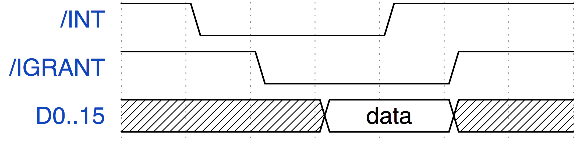

Interrupt capable devices
=========================

QNICE-FPGA features a Daisy chain architecture for interrupt capable devices.
At the very "left" side of this chain is the CPU, then the devices are
chained together:

```
CPU <=> Device 1 <=> Device 2 <=> ... <=> Device n
```

Each interrupt capable device needs to follow the protocol specified in this
file, otherwise the chain might break and/or very difficult to reproduce
bugs might occur.

**Important: We strongly recommend to use the module `vhdl/daisy_chain.vhd`
instead of implementing the Daisy chain logic from scratch.**

You will find a description of how to use it below.

Basic mechanism
---------------

Please read the file [doc/intro/qnice_intro.pdf](intro/qnice_intro.pdf) for
all the details. Here is the summary:

* The CPU features two lines to deal with external interrupts, both lines have
  inverted logic, i.e. `1` is `inactive` and `0` is `active`.
  ```
  INT_N          : in std_logic;
  IGRANT_N       : out std_logic;  
  ```

* To request an interrupt, a device is pulling `INT_N` to `0`.

* As soon as the CPU is able to service the interrupt, it will pull
  `IGRANT_N` to `0`. This means, that the device shall now put the address of
  the desired ISR onto the data bus. Please notice: It might take a while
  until the CPU is able to service the interrupt, because for example there
  might be already an ISR running and then the interrupt requests of other
  devices might be serviced first. So any device needs to be prepared to
  wait "indefinitely" long until the interrupt request is granted.

* As soon as the ISR address data that the device put on the data bus is
  valid, the device pulls `INT_N` back to `1`.

* The CPU now reads the data and pulls `IGRANT_N` to `1` to notify the device
  that it must release the data bus. This release must happen immediatelly
  (use combinatorial logic).

* The CPU then jumps to this address and executes the ISR.



Daisy chaining
--------------

```
CPU <=> Device 1 <=> Device 2 <=> ... <=> Device n
```

* The basic idea of the Daisy chaining protocol used at QNICE-FPGA is that
  no device is aware of its "position" within the Daisy chain. It might be
  located right next to the CPU or it might be located "far away".

* Every interrupt capable device must support the following signals:
  ```
  -- "left/right" comments are meant to describe a situation, where the CPU is the leftmost device
  int_n_out      : out std_logic;    -- left device's interrupt signal input
  grant_n_in     : in std_logic;     -- left device's grant signal output

  int_n_in       : in std_logic;     -- right device's interrupt signal output
  grant_n_out    : out std_logic;    -- right device's grant signal input  
  ```
  In this description, "left" is a device (or the CPU) that has the authority
  to grant an interrupt to our device. And the "right" device is a device "right"
  next to our device, which is dependent on our device granting an interrupt
  to it. Ultimately this authoritry of course stems from the CPU. Due to the
  very nature of the Daisy chain mechanism, an **interrupt request** is passed
  from device to device to "the left" until it reaches the CPU and
  an **interrupt grant** is passed from device to device to "the right" until
  it reaches the requesting device.

* There are two very important mechanisms that need to be built into all
  interrupt capable devices. These are "Pass-Through" and
  "Wait-until-it-is-our-turn":


  1. **Pass-Through:** If the device is idle regarding interrupts, i.e. it
     does not need to request an interrupt, then it just passes through the
     `int_n_in` (interrupt request output from the "right" device that is an
     input for our device) to the `int_n_out` (interrupt request input of the
     "left" device that is an output for our device). Additionally, the
     `grant_n_in` (interrupt grant output from the "left" device, that is
     an input for our device) to the `grant_n_out` (interrupt grant input
     of the "right" device, that is an output for our device). Both pairs of
     signals must be connected combinatorially.

  2. **Wait-until-it-is-our-turn:** This mechanism might require a more
    complex logic, so do not underestimate the subtleties: If our device needs
    to request an interrupt (e.g. due to a timer that has fired or due to a
    VGA scanline that has been reached), it might happen that we need to wait
    rather long until it is our turn. The CPU might be busy with active ISRs
    or devices with higher priorities (left of us) might be also waiting
    to issue their request.
    Or - and this needs special attention - the device that is "right" of us
    already started its interrupt request during our "idle" phase (as
    described above). In such a case, we need to monitor the activity that is
    already taking place and only if the already running activity is over, we
    can request an interrupt. In other words: Our device **must never**
    interfere with an already active transaction of a device that is located
    to "the right" of us.
    Depending on your requirements and the behavior you would like to
    implement, this whole section means, that you might need a FIFO buffer
    to queue waiting interrupts or other mechanisms **to avoid blocking your
    device while it waits for its turn**.

* All of this means also: The "closer" a device is to the "left" (i.e. near
  to the CPU), the higher is the priority of its interrupts.

* There is a well-commented reference implementation of the Daisy chain
  handling in `vhdl/timer.vhd` in the process `fsm_output_decode`.

Re-useable module `vhdl/daisy_chain.vhd`
----------------------------------------

We strongly recommend that interrupt capable devices use the module
`vhdl/daisy_chain.vhd`. This module is responsible for handling the daisy
chaining protocol, and by instantiating this module, the device itself need not
be concerned with the daisy chaining protocol.

This module allows the device to provide just two signals:

* `int_n_o`
* `grant_n_i`

The signal `int_n_o` is edge-triggered and latched. This means that the device
pulls the `int_n_o` signal low any time the device wishes to request an
interrupt. This signal may be low for just a single clock cycle, or may be held
low as long as is needed and/or convenient. The device need not wait for the
interrupt to be granted.  The daisy chain module will remember the falling edge
of `int_n_o` and will - eventually - grant an interrupt to the device.

The signal `grant_n_i` should be used to combinatorially drive the ISR address onto
the data bus, i.e. something like:

```
data_o <= isr_address when grant_n_i = '0' else ...
```

In the typical device there will be no connection between the signals `int_n_o`
and `grant_n_i`. It is this separation of concerns (between the two signals) that
makes the `daisy_chain` module convenient to use.


