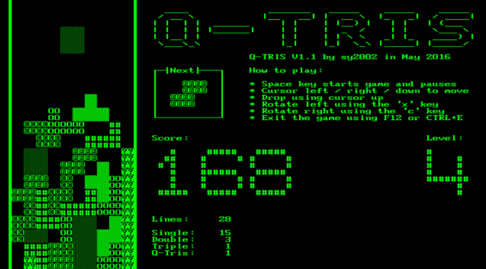

 
This is the online version of the
[QNICE emulator](https://github.com/sy2002/QNICE-FPGA/tree/master/emulator).
It uses WebAssembly and WebGL, so if you are not seeing a `QMON>` prompt
and a blinking cursor above, then your web browser probably does not support
these technologies. You might want to use the native offline version in this
case.

First Steps
-----------

* Enter `f` and then `r` and then type in `qbin/mandel.out` and press ENTER.
  You should see a text-mode rendition of the famous Mandelbrot set.
* Press CURSOR UP or CURSOR DOWN to scroll up/down.
* Press `h` to see the available commands.
* Enter `m` and then `s` and then type in `A000` and then `A010` to see the
  disassembly of the first bunch of machine instructions of the Mandelbrot
  program.
* The emulator can mount FAT32 images, for example SD card images as
  QNICE-FPGA can also handle FAT32 formatted SD cards. The minimum of any
  FAT32 image is 32MB. This online version of the emulator mounts a 32 MB
  disk image that contains the folders
  [c/test_programs](https://github.com/sy2002/QNICE-FPGA/tree/master/c/test_programs),
  [demos](https://github.com/sy2002/QNICE-FPGA/tree/master/demos),
  [qbin](https://github.com/sy2002/QNICE-FPGA/tree/master/qbin) and
  [test_programs](https://github.com/sy2002/QNICE-FPGA/tree/master/test_programs).
* For having a look at the Mandelbrot source code, start the mini shell using
  `f` and then `r` and then type in `qbin/shell.out`. After that, enter
  `cd demos` and then `cat mandel.asm` into the shell and then use CURSOR
  UP and CURSOR DOWN to scroll and read the source code.

More Programs to Try
--------------------

* If you are still running the mini shell, then leave it by entering `exit`.
* Change the directory to the `qbin` folder by entering `f` then `c` and then
  `qbin`.
* List the directory by entering `f` and then `d`.
* Wolfram's Cellular Automata: use `f` and `r` to run `wolfram.out`
* Sierpinski Fractal Generator: run `sierpinski.out`
* Abandoned Farmhouse Adventure: run `adventure.out`
* Tic-Tac-Toe: run `ttt2.out`
* Moveable and Zoomable Mandelbrot: run `mandel_zoom.out`

Playing Q-TRIS
--------------

* Q-TRIS is a Tetris clone and the first game ever developed for QNICE-FPGA
  The rules of the game are very close to the "official" Tetris rules as they
  can be found on
  [Wikia](http://tetris.wikia.com/wiki/Tetris_Guideline).
* If you switched to the `qbin` folder as described above, then now enter
  `f`and then `r` and then `q-tris.out` to start the game. If you are somewhere
  else in the file system, you can enter `/qbin/q-tris.out` (including the
  leading forward slash `/`) to start the game.
* Run the game for having a realistic baseline and while it runs, adjust
  the emulation speed to match 12.9 MIPS as close as possible. This provides
  you with the same gaming experience as you would have on the QNICE-FPGA
  hardware.
* The current high score can be found
  [here (Link)](https://github.com/sy2002/QNICE-FPGA/blob/master/doc/demos/q-tris-highscore.txt).

Adjusting the Emulation Speed
-----------------------------

* The emulation speed depends on how many QNICE CPU instructions the emulator
  is performing per frame and on the amount of frames per second that your
  hardware is able to draw while calculating the before-mentioned amount
  of instructions.
* Press `ALT+f` to toggle between showing and hiding the MIPS (million
  instructions per second) and the FPS (frames per second). The numbers
  are displayed at the top-right corner of the screen and the display stays
  on, until toggled again.
* `ALT+v` to see, how many instructions per frame are currently being
  executed. The amount is displayed in a window in the middle of the screen,
  which disappears after about three seconds. The speed change windows, that
  are described in the following bullet points, are disappearing after about
  three seconds after the last keypress as well.
* `ALT+SHIFT+n`: decrease instructions per frame (IPF) by 100,000
* `ALT+n`: decrease IPS by 2,500
* `ALT+SHIFT+m`: increase IPF by 100,000
* `ALT+m`: increase IPF by 2,500

Caveats
-------

Currently the emulator is hardcoded to the German keyboard layout. If you
are not able to enter a forward slash `/` when trying to enter
`qbin/mandel.out` after having pressed `f` and then `r` as described above,
then just switch into the right directory first, and then run a file:
Press `f` and `c` to change into a directory, for example into `qbin`. And
then run the file with `f` and then `r` and then enter `mandel.out`.

You currently cannot copy from or paste to the emulator window. Use the
native offline version, if you need for example to work with "memory load"
(press `m` and then `l`) for loading your own `.out` files.

The speed of the QNICE-FPGA hardware running at 50 MHz is 12.9 MIPS
(million instructions per second). The emulator may run too fast in your web
browser. You need to adjust the emulation speed to match the hardware
manually.
