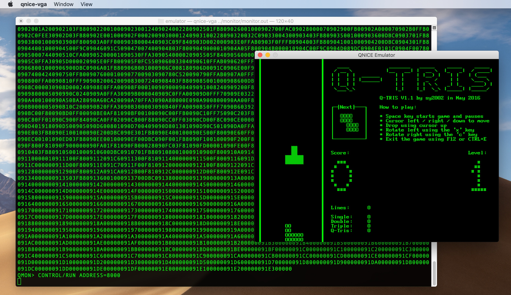

QNICE Emulator
==============



There are three flavors of QNICE emulators:

* **POSIX Terminal**: Emulation of a QNICE system that only offers a serial
  connection for input/output. Runs in any POSIX terminal. Use `make.bash`
  to build.

* **SDL OpenGL Window**: Full QNICE-FPGA emulation including the VGA screen
  and the PS/2 keyboard. Opens two windows:
  One using the POSIX terminal for emulating a serial
  connection and in parallel a graphics window for the VGA output. Needs SDL2
  to compile. Use `make-vga.bash` to build or use `run-vga.bash` to
  automatically build, download a disk image and run.

* **WebAssembly/WebGL**: Running in any modern web browser, the
  WebAssembly/WebGL flavor of the emulator is extremely easy to use and very
  portable. Needs Emscripten and SDL2 to compile. Use `make-wasm.bash`
  to build.
  Try a [prebuilt version online here](http://qnice-fpga.com/emulator.html),
  which mounts a FAT32 disk image that contains among other things
  also Q-TRIS.

Getting Started
---------------

### Build the Toolchain, the Monitor and the Demos

* Open a terminal and go to a folder, where git is allowed to create a
  subfolder called `QNICE-FPGA` and enter
  `git clone https://github.com/sy2002/QNICE-FPGA.git`

* After that, you should have a folder called `QNICE-FPGA`. `cd` into that
  folder now. From now, all instructions will be relative to this folder.

* Compile the toolchain: You need to have the GNU compiler toolchain
  installed, particularly `gcc` and `make` will be used. Open a terminal in
  the QNICE root folder. Enter the following (it is important, that you `cd`
  into the folder):
  ```
  cd tools
  ./make-toolchain.sh
  ```
  You will be asked several questions. Answer them using the default answers
  by pressing `Enter` instead of answering manually by choosing `y` or `n`.
  When done, `cd ..` back to the QNICE root folder.

* Compile the Monitor, which is akin to an operating system for QNICE-FPGA. If
  you are still in the `tools` folder, then enter:
  ```
  cd ../monitor
  ./compile_and_distribute.sh
  ```
  The resulting `monitor.out` file is what the emulator needs.

* Given, that you are still in the `monitor` folder, enter:
  ```
  cd ../demos
  ../assembler/asm mandel.asm
  ../assembler/asm q-tris.asm
  cat mandel.out|pbcopy
  ```

* On macOS, you now have an ASCII file in the clipboard/pasteboard that starts
  with the line `0xA000 0x0F80`. On other operating systems, you might see an
  error message, stating that `pbcopy` is not available. You can savely
  ignore this and manually copy the file `demos/mandel.out` into your
  clipboard/pasteboard.

### POSIX Terminal: Emulation using Serial I/O

* Navigate to the `emulator` path and compile it using `./make.bash`.

* Run the emulator and let it instantly load the Monitor:
  `./qnice ../monitor/monitor.out`

* Enter `M` and then `L` into the Monitor window. After that, you should
  see something like `QMON> MEMORY/LOAD - ENTER ADDRESS/VALUE PAIRS,
  TERMINATE WITH CTRL-E`

* Press `CMD+V` for PASTING the mandel.out textfile, that should be still
  in your clipboard, if you followed the above-mentioned steps.

* Press `CTRL-E` now, to go back to the Monitor. You should see the `QMON>`
  prompt again. (This mechanism can also be used in the below-mentioned
  qnice-vga, even though it is not explicitly mentioned again there.)

* Enter `C` and then `R` and then `A000`.

* You should see a textmode rendition of the famous Mandelbrot set.

* Press `CTRL+C` to leave the Monitor and to return back to the `Q>` prompt.
  Press `CTRL+D` or enter `exit` to end the emulator.

### SDL OpenGL Window: Emulation of the VGA Screen and the PS/2 Keyboard

* You need [libsdl](https://www.libsdl.org/) for compiling.

* If you are connected to the Internet, then enter `./run-vga.bash` to
  download a disk image with demo content, compile the SDL OpenGL version
  of the emulator (aka qnice-vga) and run it while mounting the disk image.

* As soon as qnice-vga runs, an additional window will open, so that
  the emulator now has two windows open: The POSIX terminal window, that
  shows the `QMON>` prompt and a blinking cursor; this is the emulation of
  the serial I/O. Furthermore, an additional graphical window is open. It
  is mainly black and shows a blinking cursor.

* Go to the `QMON>` prompt in the terminal window and enter `F` and then
  `R` and then `qbin/q-tris.out` to run Q-TRIS.

* Go to the graphical window, press `SPACE` and start playing. The emulator
  automatically attempts to regulate the speed to `12.9 MIPS`, which is
  the speed of the original QNICE-FPGA hardware running at 50 MHz. Toggle
  the MIPS and FPS display using `ALT+F`.

* Go back to the terminal window where you see `Running...` and press
  `CTRL+C` to end Q-TRIS.

* Enter `help` to see the various Monitor commands and keyboard shortcuts.

* Instead of loading a file from the virtual FAT32 formatted SD Card that is
  located in the file `qnice_disk.img` (downloaded when you first run
  `./run-vga.bash`), you can also directly load something into the emulator's
  memory using the `load` command in the `Q>` shell:
  `load ../demos/mandel.out`

* And instead of using the Monitor to run something, you can also point the
  emulator directly to a certain memory address and execute. The Mandelbrot
  demo is at `$a000`, so enter `run $a000`. You will see the textmode
  rendition of the Mandelbrot set in the POSIX terminal window.

* The `Q>` prompt is replaced by the `QMON>` prompt because the
  `SYSCALL(exit, 1)` command in `demos/mandel.asm` jumps back to the Monitor.

* Enter `CTRL+C` and then in the `Q>` shell enter `switch 3` and then `run 0`
  and then switch to the graphical window and enter `C` and `C` to clear
  the screen. The `switch 3` command routed STDIN now to the PS/2 keyboard
  emulation and STDOUT to the VGA screen.

* While being in the VGA screen, enter `C` and then `R` and then `a000`.
  The Mandelbrot rendition is shown in the VGA screen. Press the
  `CURSOR UP` key three times to see the rendition nicely centered.

* Go to the POSIX terminal window, press `CTRL+C` to leave the Monitor
  and to return back to the `Q>` prompt. Press `CTRL+D` or enter `exit` to
  end the emulator.

WebAssembly/WebGL in a Web Browser: Emulation of the VGA Screen and the PS/2 Keyboard
-------------------------------------------------------------------------------------

* You can [try it out online](http://qnice-fpga.com/emulator.html).
  The following steps show how to build and run a local version.

* If you followed all above-mentioned instructions in sequence, then you
  have downloaded the file `qnice_disk.img`, which contains a FAT32 disk
  image with demo programs. If you jumped directly to this section, then you
  need to download it using `wget` or `curl`. Enter the following two
  lines:
  ```
  DISK_IMAGE=http://sy2002x.de/hwdp/qnice_disk.img
  wget $DISK_IMAGE || curl -O $DISK_IMAGE
  ```

* You need to build the toolchain and the Monitor as described above
  and you need the
  [Emscripten SDK](https://emscripten.org/docs/getting_started/downloads.html).
  Activate the Emscripten SDK using the `source emsdk_env.sh` command while
  being in the Emscripten SDK home folder.

* Open `qnice.c` in a text editor and search for `sy2002x.de`. You should
  find a line that contains the `emscripten_wget()` function. Change that line
  so that it looks like this, so that your local FAT32 disk image is used
  instead of the online version:
  ```
  emscripten_wget("qnice_disk.img", "qnice_disk.img");

  ```

* Build the emulator using `./make-wasm.bash`.

* Run a local webserver by entering `python -m SimpleHTTPServer 8080`.

* Point your web browser to `http://localhost:8080/qnice.html`.

* Enter `F` and then `R` and then `qbin/q-tris.out` to play Q-TRIS.

#### Adjusting the Emulation Speed

* In contrast to the native qnice-vga version of the emulator, the
  WebAssembly/WebGL version is not capable to automatically regulate the
  speed to match the `12.9 MIPS` of the FPGA hardware that runs at 50 MHz.
  Probably your computer will be faster, so you will need to slow down
  the emulation speed.

* The emulation speed depends on how many QNICE CPU instructions the emulator
  is performing per frame and on the amount of frames per second that your
  hardware is able to draw while calculating the before-mentioned amount
  of instructions.

* Press `ALT+f` to toggle between showing and hiding the MIPS (million
  instructions per second) and the FPS (frames per second). The numbers
  are displayed at the top-right corner of the screen and the display stays
  on, until toggled again.

* `ALT+v` to see, how many instructions per frame are currently being
  executed. The amount is displayed in a window in the middle of the screen,
  which disappears after about three seconds. The speed change windows, that
  are described in the following bullet points, are disappearing after about
  three seconds after the last keypress as well.

* `ALT+SHIFT+n`: decrease instructions per frame (IPF) by 100,000

* `ALT+n`: decrease IPS by 2,500

* `ALT+SHIFT+m`: increase IPF by 100,000

* `ALT+m`: increase IPF by 2,500

#### Using GZIP on the Web Server

Due to the fact that the minimum disk image size of FAT32 images is 32MB, it
makes sense to have the web server GZIP the file before sending it to the
browser. This will greatly increase the download speed and can be done on
Apache web servers using the following commands in the .htaccess file:

```
<IfModule mod_deflate.c>
AddOutputFilter DEFLATE img
</IfModule>

```

For other web servers there are similar mechanisms available.
If the download server is on another domain than the WASM file, then due to
CORS, the following needs to be added to the .htaccess file:

```
<IfModule mod_headers.c>
Header set Access-Control-Allow-Origin "*"
</IfModule>
```

Emulator Architecture
---------------------

* `qnice` and `qnice-wasm` are single-threaded. `qnice-vga` is multi-threaded.

* `qnice.c` contains the main program and the CPU emulation.
  The function `int execute()` is the core of the emulation as it executes a
  single QNICE instruction and updates the whole state machine.

* QNICE-FGA uses memory mapped I/O, so does the emulator. This is why
  the memory access is funneled through the function
  `unsigned int access_memory(...)` that explicitly routes certain memory
  reads or writes through the register access functions of the emulated
  hardware (IDE, SD card, UART, VGA in the respective `.h` and `.c` files).

* The FAT32 emulation is part of the Monitor, so that the SD card emulation
  of the emulator nothing more than a buffered direct file access.

* `qnice-vga` and `qnice-wasm` need a FIFO for their keyboard input, albeit
  at completely different spots in their logic. `fifo.c` is a simple
  but thread-safe implementation of such a FIFO.

### POSIX Terminal (`qnice`) Specifics

* Input/Output is emulated by emulating a serial connection in `uart.c`.

* As soon as the emulation runs (e.g. by entering `run` in the `Q>` shell),
  the POSIX STDIN is switched from the usual line buffer mode where you
  need to end a line with `ENTER` to an unbuffered mode. This is done in
  `uart.c` in the function `uart_hardware_initialization`.

* `select()` and `getchar()` are used to read from the keyboard. (Due to
  `select()` having a timeout, this mechanism is not feasable in the
  `qnice-vga` mode, because it would significantly slow down the speed
  and would introduce skew and jitter for any automated MIPS calculation.)

### SDL OpenGL Window (`qnice-vga`) Specifics

* Uses six threads. The threading is based on SDL's threading mechanisms for
  easy portability. Therefore all the threads are started using the function
  `int vga_create_thread(...)` from `vga.c` which encapsulates the appropriate
  SDL functions. All threads use global variables for synchronization. All
  these global variables are written and read carefully, so that no mutex
  or semaphores are necessary and race-conditions are still being avoided.

* The main thread runs the SDL event loop and therefore reads the keyboard
  and updates the screen: `int vga_main_loop()` in `vga.c`. It is noteworthy
  that the screen refresh speed is throttled to 60 FPS, which greatly reduces
  system strain. The CPU emulation is decoupled from drawing the screen, so
  more FPS do not lead to more MIPS.

* The CPU emulation is in a separate thread, so that modern multi-core systems
  can play to their strengths and maximize emulation performance.
  The function `static int emulator_main_loop(...)` is just an encapsulation
  of the same `int main_loop(...)` function, that also the POSIX terminal
  `qnice` is using.

* Various parts of the system need a consistent clock. This is why
  `int vga_timebase_thread(...)` in `vga.c` is updating the global variable
  `gbl$sdl_ticks` every millisecond.

* The original QNICE-FPGA hardware performs `12.9 MIPS` while running at
  50 MHz. Most modern systems will emulate QNICE-FPGA much faster. The
  speed regulation mechanism is implemented in the function `void run()`
  by calculating how many QNICE instructions per 10 milliseconds need to
  be performed to match the original hardware's speed. The value is stored
  in `gbl$target_iptms`. Due to jitter and skew, this value is only an
  approximation. Therefore the thread `int mips_adjustment_thread(...)`
  compares the actual MIPS with the target MIPS every three seconds and
  then calculates the adjustment factor `gbl$target_iptms_adjustment_factor`
  that is multiplied with `gbl$target_iptms`.

* POSIX signal handlers are not working consistently and reliably in
  multithreaded environments. Therefore 
  `static int signal_handler_ctrl_c_multithreaded(...)` uses `sigwait` to
  wait for the user to press `CTRL+C`.

* The thread `int uart_getchar_thread(...)` in `uart.c` uses the `poll(...)`
  function with a 5 millisecond timeout to read keys from the keyboard into
  the FIFO. The read-access via emulated UART registers happens in parallel
  and in high-speed in the CPU thread. Consequently, `fifo.c` uses
  SDL's Mutex mechanism for ensuring thread-safety.

* The emulated VGA screen is an OpenGL streaming texture: A pixel buffer in
  main memory that represents the screen is repeatedly copied ("streamed")
  into a texture buffer in the GPU's RAM and from there copied to the
  screen. `void vga_one_iteration_screen()` in `vga.c` shows this
  mechanism.

* For maximizing the VGA screen's performance, the pixel buffer is modified
  one character at a time in contrast to re-rendering it for each frame.
  This corresponds to the way how QNICE-FPGA's VGA hardware works: Also there,
  you can always only modify one character at a time in VRAM, because the
  VRAM is not mapped to QNICE-FPGA's RAM, but only accessible via
  memory mapped registers.
  `void vga_render_to_pixelbuffer(...)` in `vga.c` is doing the job of
  modifing the pixel buffer in the array `screen_pixels`.

* The various overlay windows that are visible in the context of speed
  adjustments (e.g. by pressing `ALT+v` or `ALT+n`) are rendered using
  `void vga_render_speedwin(...)` in `vga.c`.

* The keyboard management is currently hardcoded to a German keyboard using
  a large and nested `if` and `case` structures in
  `void kbd_handle_keydown(...)` (`vga.c`). Future versions of the emulator
  might want to utilize more flexible mechanisms.

### WebAssembly/WebGL (`qnice-wasm`) Specifics

* The following files are constituting the executables of the WebAssembly
  version of the emulator:
  ```
  qnice.html
  qnice.js
  qnice.wasm
  ```

* Emscripten offers a virtual file system that is linked during compile
  time. When an Emscripten app starts, the appropriate data file is
  automatically loaded and the virtual file system is immediatelly
  available via the C standard library functions. The file `qnice.data`
  contains the Monitor in such a virtual file system, so that the Monitor
  can be loaded immediatelly after startup using the regular
  `load_binary_file("monitor.out")` function call. There is no `Q>` shell
  available in `qnice-wasm`.

* The minimum file size of a FAT32 disk image is 32MB. Emscripten cannot
  package files that big into the virtual file system. This is why the disk
  image is loaded via the Internet using `emscripten_wget(...)` in `qnice.c`.

* At the time of writing `qnice-wasm`, WebAssembly only supports
  single-threaded apps, which are forced to yield CPU cycles back to the
  browser in the sense of cooperative multitasking. `emscripten_sleep(...)`
  in `qnice.c` performs this task.

* Speed regulation is done by defining an amount of QNICE instructions that
  shall be executed in each "iteration". One iteraton (in pseudocode) looks
  like this:
  ```
  Perform the amount of QNICE instructions defined in gbl$instructions_per_iteration
  Yield CPU cycles back to the browser
  Read keys from the keyboard
  Update the screen
  ```

* Depending on the setting of `gbl$instructions_per_iteration`, the interval
  between two keyboard buffer reads might be quite high, this is why the
  FIFO buffer from `fifo.c` is utilized in `vga.c`.
