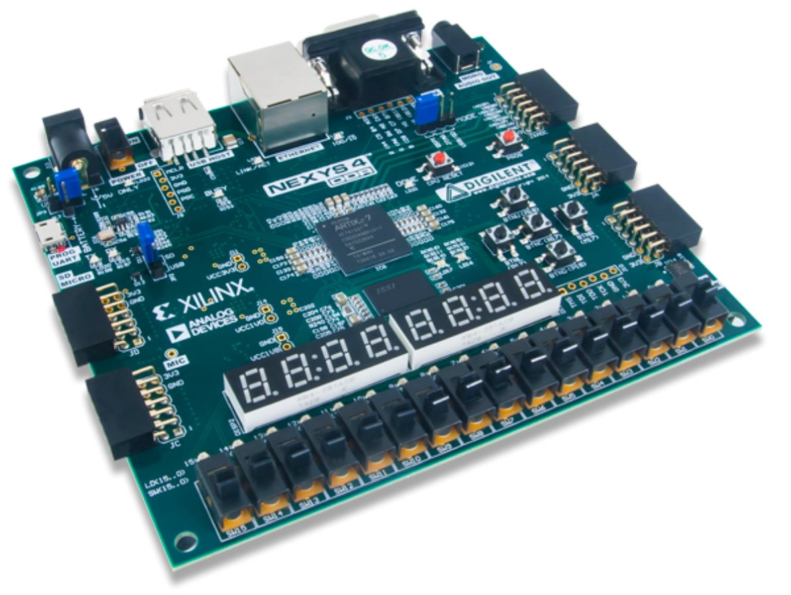
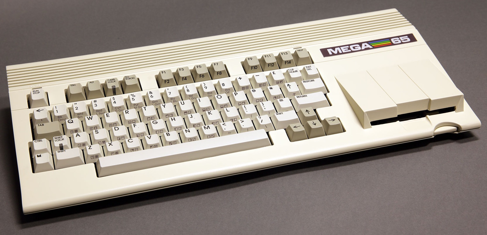

Hardware
========

We created QNICE-FPGA as a portable System-on-a-Chip, so that it should be
possible to synthesize it for any suitably powerful FPGA board.

This folder contains the FPGA vendor specific and board (hardware instance)
specific files necessary to synthesize the QNICE-FPGA bitstream. Currently
we are supporting these vendor/board/toolchain combinations:

* Xilinx: **Nexys4 DDR** and **Nexys A7** using Vivado or ISE
* Xilinx: **MEGA65** using Vivado or ISE

Scroll down to the respective section to learn more about a particular
supported combination. And if your hardware is not included here, please
read on at the section "General advice for porting".

The structure of this folder is:

```
<fpga-vendor>/<board (hardware)>/<toolchain (IDE)>
```

Additionally there are hardware specific VHDL files in

```
vhdl/hw/<board (hardware)>
```

General advice for porting
--------------------------

* In general, the code is written in a portable way and therefore is
  suitable as a good starting point for porting the QNICE-FPGA
  implementation for Digilent's Xilinx Virtex-7 based board
  "Nexys4 DDR": Create two new folders according to the folder
  structure mentioned above. Copy this top file into your own folder:
  `vhdl/hw/nexys4ddr/env1.vhd`. You might want to rename it to match your
  hardware's or port's name. Start modifying this top file to fit your needs.

* If you are not on Xilinx hardware, then the first thing you might want to do
  is to rewrite the file `clk.vhd`. The idea behind this file is to gather
  together everything related to clock generation in a single file with no
  other responsibilities, so as to simplify porting.  Currently, this file
  makes use of the Xilinx primitive `MMCME`, which is a PLL that generates the
  CPU clock speed of 50 MHz, and the VGA clock speed of 25.2 MHz. If your
  hardware does not support PLL's then you may use a 25.0 MHz clock for the VGA
  signal, this is absolutely ok. A clock frequency of 25.0 MHz may be generated
  using a simple clock divider.  Do not forget to set appropriate timing
  constraints for the clock in the IDE or development environment of your
  choice; `TS_clk25MHz` in `env1.ucf` might be an inspiration.

* In the file `hw/xilinx/nexys4ddr/ISE/env1.ucf` you will find advice
  about how to do the mapping from the NETs to the hardware's pins and what
  kind of timing constraints you might want to use.

* Make sure that you connect at least the IO pins for PS2, VGA, UART
  and the two switches (`SWITCHES<0>` and `SWITCHES<1>`).

* The system is designed to run at 50 MHz. Other speeds would break various
  timings (see also [TODO.txt](../TODO.txt) to learn more). `env1` expects to
  receive a 100 MHz clock, which it then divides down to the
  50 MHz clock `SLOW_CLOCK`.

* EAE's combinatorial division networks take longer than the regular 50 MHz
  clock period, so be sure to specify a timing constraint for your specific
  hardware/toolchain combination. `hw/xilinx/nexys4ddr/ISE/env1.ucf` can be
  used as an inspiration.

* `env1_globals.vhd` contains several important global constants. You can for
  example define the content of the ROM there by changing `ROM_FILE`.
  One application for this is to transform QNICE-FPGA into a
  "Q-TRIS Arcade Machine" by using `demos/q-tris.rom` compiled with the define
  `QTRIS_STANDALONE`. Another one might be to replace the "operating system"
  that we call "Monitor" (`monitor/monitor.rom`) by something else.
  You can also use `env1_globals.vhd` to reduce the amount of registers
  (the size of the register file) by changing `SHADOW_REGFILE_SIZE`. But be
  aware that some QNICE programs may fail as the QNICE ISA demands the
  amount of shadow registers to be 256.


Nexys 4 DDR and Nexys A7
------------------------



Currently, our reference development board is a 
[Nexys 4 DDR](https://store.digilentinc.com/nexys-4-ddr-artix-7-fpga-trainer-board-recommended-for-ece-curriculum/),
which has been retired by Nexys but you can still get it on eBay. As far as
we know, the sucessor
[Nexys A7](https://store.digilentinc.com/nexys-a7-fpga-trainer-board-recommended-for-ece-curriculum/)
is compatible, so we currently assume, that you can use the Nexys 4 DDR
files to also synthesize for the Nexys A7.

The top file for this platform is [vhdl/hw/nexys4ddr/env1.vhd](../vhdl/hw/nexys4ddr/env1.vhd).

For a quickstart, you can download the bitstream
[here](../dist_kit/bin/QNICE-V16.bit). If you just want to use your Nexys board as a Q-TRIS Arcade
machine, then you can download
[this](../dist_kit/bin/QTRIS-V16.bit)
bitstream.

### ISE 14.7

We created the original QNICE-FPGA using
[Xilinx' ISE 14.7](https://www.xilinx.com/support/download/index.html/content/xilinx/en/downloadNav/vivado-design-tools/archive-ise.html).
The free ISE WebPACK license is sufficient for working with QNICE-FPGA.
Open the project `hw/xilinx/nexys4ddr/ISE/env1.xise` to synthesize using ISE.

### Vivado 2019.2 (or newer)

Vivado is the successor of ISE. Even though ISE can still be downloaded for
free from Xilinx as the time of writing, Vivado is the way to go when
developing for Xilinx FPGAs. So we made a port of QNICE-FPGA to Vivado,
which you can 
[download here](https://www.xilinx.com/support/download.html);
we recommend to use the "HLx Editions" with the free Vivado WebPACK license.
Open the project `hw/xilinx/nexys4ddr/Vivado/qnice_nexys.xpr`
to synthesize using Vivado.

Specifics of the Nexys 4 DDR and Nexys A7 hardware
--------------------------------------------------

* The CPU Reset button works as expected.

* STDIN: You can use serial in or an USB keyboard. Use the rightmost switch
  `SW0` to toggle: `off` equals serial in and `on` means keyboard. Have a look
  at [doc/constraints.md](../doc/constraints.md) to learn which keyboards are
  working. When switching between one STDIN to another STDIN you need to
  press a key one more time on the "old" STDIN after you switch, before the
  new STDIN starts working.

* STDOUT: You can use serial out or a VGA monitor. Use the second switch
  counted from right `SW1` to toggle: `off` equals serial out and `on` means
  VGA.

* Serial communication: `115,200 baud, 8-N-1, RTS/CTS ON`. Note that on
  some Linux machines the serial terminal program `picocom` is buggy. See
  [doc/constraints.md](../doc/constraints.md) for more details and
  a work-around.

* Debug mode: If switch `SW2` is on, then the value of the CPU's address lines
  is shown in real-time on the 7-segment-display. This means, that on `HALT`
  you will see the program counter (PC) of the `HALT` command.

* The SD Card slot is supported. Use FAT32 formatted cards and have a look at
  [doc/constraints.md](../doc/constraints.md) to learn which SD Cards are
  working. Use the Monitor's `F` command group to access the SD Card, e.g. use
  `F` and then `D` to show the contents of the current directory.

* Not used/supported: Pushbuttons other than the CPU Reset button; ethernet
  connector; Pmod connectors; audio out

MEGA65
------



The MEGA65 is the 21st century realization of the Commodore 65 heritage:
A complete 8-bit computer running around 50x faster than a C64 while
being highly compatible. Go to [mega65.org](https://mega65.org/) to learn
more about it.

The MEGA65 is an open source / open hardware project available
[here on GitHub](https://github.com/MEGA65/). It supports multiple so called
"Cores", which means that you can upload your own hardware to MEGA65's FPGA,
which is a Xilinx Artix-7 in a `xc7a100tfgg484` package.

Hint: ISE or Vivado bitstreams (`.bit` files) need to be converted into
MEGA65 Cores (`.cor` files) by using the `tools/bit2core` tool. The bitstream
needs to be in a specific format as described [here](../tools/bit2core.c#L16)
to work as a Core on the MEGA65.

For a quickstart, you can download the ready-made QNICE-FPGA Core for MEGA65
[here](../dist_kit/bin/MEGA65.cor). If you want to use the MEGA65 as a
Q-TRIS Arcade machine, then download [this](../dist_kit/bin/M65QTRIS.cor)
Core. Have a look at [doc/README.md](../doc/README.md) to learn how to install
and run the QNICE-FPGA core on the MEGA65.
 
### ISE 14.7

Use the project `hw/xilinx/MEGA65/ISE/QNICE-MEGA65.xise` to synthesize
for MEGA65 using ISE. The bitstream format is already configured to be
compatible with MEGA65 Cores. Right-click "Generate Programming File" in 
ISE's process view and choose "Process Properties" to learn more.

The top file for MEGA65 using ISE is
[vhdl/hw/MEGA65/MEGA65_ISE.vhd](../vhdl/hw/MEGA65/MEGA65_ISE.vhd).

Currently, HyperRAM is deactivated when synthesizing with ISE. Please have
a look at [doc/constraints.md](../doc/constraints.md) to learn more.

### Vivado 2019.2 (or newer)

Use the project `hw/xilinx/MEGA65/Vivado/MEGA65.xpr` to synthesize for MEGA65
using Vivado. The bitstream format is already configured to be compatible
with MEGA65 Cores. Look at the
[XDC file](../hw/xilinx/MEGA65/Vivado/mega65.xdc), section
"## Configuration and Bitstream properties" to learn more.

The top file for MEGA65 using Vivado is
[vhdl/hw/MEGA65/MEGA65_Vivado.vhd](../vhdl/hw/MEGA65/MEGA65_Vivado.vhd).

### MEGA65 board revisions and hardware versions

For the QNICE @ MEGA65 release at hand, we used the very first MEGA65
prototype computer, which has the board revision 2 (MEGA65R2). There where
only a couple of those prototypes produced, so you will probably have a newer
board revision: The first publicly available MEGA65 computer will be the
[MEGA65 DevKit](https://shop.trenz-electronic.de/en/30390-MEGA65-Development-Kit-highly-advanced-C64-and-C65-compatible-8-bit-computer)
with board revision 3 (MEGA65R3). And the final product for the market might
have an even higher board revision.

For learning more about how QNICE-FPGA supports the different MEGA65 hardware
versions, have a look at [doc/README.md](../doc/README.md).

Specifics of the MEGA65 hardware
--------------------------------

### SD Card

The MEGA65 features two SD card slots: One at the rear side of the case and
one at the bottom of the case under a cover.

Currently, QNICE-FPGA only supports the one at the bottom under the cover.

### Installing the QNICE core on MEGA65

1. Copy the [QNICE @ MEGA65 core](../dist_kit/@TODO) onto a FAT32 formatted
   SD Card.

2. Power-on the MEGA65 while you hold the `No Scroll` key.

3. Choose an empty slot using `CTRL` plus the number of the empty slot.

4. Choose a `.cor` file from your SD Card using the arrow keys and `Return`.

5. The MEGA65 is storing the core in non-volatile memory so that from now on,
   you can directly boot the core.

### Booting the QNICE core

1. Power-on the MEGA65 while you hold the `No Scroll` key.

2. Choose the QNICE core with the arrow keys or by pressing it's number

### Creating your own `.cor` file

ISE or Vivado bitstreams (`.bit` files) need to be converted into
MEGA65 Cores (`.cor` files) by using the `tools/bit2core` tool. The bitstream
needs to be in a specific format as described [here](../tools/bit2core.c#L16)
to work as a Core on the MEGA65.

### Board and hardware revisions

For the QNICE @ MEGA65 release at hand, we used the very first MEGA65
prototype computer, which has the board revision 2 (MEGA65R2). There where
only a couple of those prototypes produced, so you will probably have a newer
board revision: The first publicly available MEGA65 computer will be the
[MEGA65 DevKit](https://shop.trenz-electronic.de/en/30390-MEGA65-Development-Kit-highly-advanced-C64-and-C65-compatible-8-bit-computer)
with board revision 3 (MEGA65R3). And the final product for the market might
have an even higher board revision.

| Hardware  | Release     | Board | Description
|-----------|-------------|-------|-------------------------------------------
| Prototype | 2019        | R2    | First MEGA65 prototype that actually looks like a MEGA65. It uses the combination of an ADV7511 chip and a TPD12S016 companion chip to produce HDMI output.
| DevKit    | 2020 (*)    | R3    | Development computer; for the first time for a broader audience. Acrylic case. At the time of writing this, we learned from the MEGA team they might drop the ADV7511.
| MEGA65 V1 | 2021/22 (*) | ?     | First release to the public

(*) means: "estimated"

Currently, we only fully support the MEGA65R2 board. That means that HDMI
output only works there. On other boards, this release (even the binary `.cor`
file) should work out-of-the-box, too. But it will only generate VGA output
and no HDMI output.

### HDMI

MEGA65 supports HDMI output. The hardware in theory is capable of displaying
different things on the VGA and HDMI output (e.g. dual-screen). For making
things simple, we are just mirroring the 640x480 @ 60 Hz VGA output on HDMI.
Just plug in your HDMI monitor and it should work. The HDMI output is
naturally much clearer and sharper than the VGA output.

For fine-tuning the HDMI output on your monitor, you can use the registers
`VGA$HDMI_H_MIN`, `VGA$HDMI_H_MAX` and `VGA$HDMI_V_MAX`. There is a test
program available where you can interactively play with these registers:
[c/test_programs/hdmi_de.c](../c/test_programs/hdmi_de.c).

### HyperRAM

MEGA65 comes with 8MB of HyperRAM which extends the 32 kWords of free RAM
that QNICE-FPGA has built-in by default. Optionally, another 8MB can be added.
We only tested and worked with the built-in 8MB of the MEGA65, but
theoretically, the system should also be able to work with 16MB.

HyperRAM is slower than the built-in RAM and QNICE-FPGA currently does not
have a memory controller, paging, DMA or similar mechanism implemented, yet.
Therefore HyperRAM can only be accessed via registers:
`IO$M65HRAM_LO`, `IO$M65HRAM_HI`, `IO$M65HRAM_DATA8` and `IO$M65HRAM_DATA16`.

Have a look at
[test_programs/MEGA65/hyperram.asm](../test_programs/MEGA65/hyperram.asm)
and at
[c/test_programs/hyperramtest.c](../c/test_programs/hyperramtest.c)
to learn more. There is also a work-in-progress demo that is meant to load
a large ASCII animation ("video clip") into HyperRAM and then display it
on the screen:
[c/test_programs/the-matrix.c](../c/test_programs/the-matrix.c)

### Keys

| Key Combination | Meaning                                |
|-----------------|----------------------------------------|
| RESTORE + 1     | Toggle STDIN: MEGA65 keyboard and UART |
| RESTORE + 2     | Toggle STDOUT: MEGA65 VGA and UART     |
| MEGA + UP       | Page Up                                |
| MEGA + DOWN     | Page Down                              |
| MEGA + LEFT     | POS1                                   |
| MEGA + RIGHT    | END                                    |
| MEGA + *        | ^ (power symbol)                       |
| MEGA + 0        | ° (degree symbol)                      |
| MEGA + e        | € (Euro symbol)                        |
| MEGA + a        | German Umlaut ä (+SHIFT: Ä)            |
| MEGA + o        | German Umlaut ö (+SHIFT: Ö)            |
| MEGA + u        | German Umlaut ü (+SHIFT: Ü)            |
| MEGA + s        | German Umlaut ß                        |

### Using Serial I/O as STDIN/STDOUT

The MEGA65 does not come with a serial interface by default. The DevKit
version is supposed to have the JTAG programmer (see description below)
built-in. For other versions you need to purchase and install the programmer.

#### Preparing your PC or Mac

* You need to use the `TE-0790` JTAG programmer as described in the chapter
  "Flashing the FPGAs and CPLDs in the MEGA65" of the
  [MEGA65 User's Guide](https://github.com/MEGA65/mega65-user-guide/blob/master/MEGA65-Book_draft.pdf).

* On some operating systems you might need to install FTDI drivers. On a Mac
  it works without additional drivers.

* The MEGA65 will show up as "Digilent USB Device" in your OS and/or terminal
  program.

* Choose "Port 2" of this device and set your terminal program to `115,200
  baud, 8-N-1 (no CTS/RTS)`. Connect to the MEGA65.

#### Routing QNICE-FPGA's STDIN/STDOUT

Press the `RESTORE` key together with the `1` to toggle STDIN between the
MEGA65 keyboard and the UART. Press `RESTORE` plus `2` to toggle STDOUT
between VGA and the UART.

Caveat: After switching STDIN to another input, you still need to press one
more key on the old input, before the switch to the new input is finally
active.

### Creating Core files

The MEGA65 is able to load `.cor` files directly from SD card, so that MEGA65
users do not need a Xilinx toolchain to change the bitstrem ("Core") that they
are running.

Core files can be generated from compatible bitstreams using `tools/bit2core`.
"Compatible" means, that the following settings are used in the Vivado `xdc`
file and/or that these properties are configured in the ISE project within
the IDE.

```
## Configuration and Bitstream properties
set_property CONFIG_VOLTAGE 3.3 [current_design]
set_property CFGBVS VCCO [current_design]
set_property BITSTREAM.GENERAL.COMPRESS TRUE [current_design]
set_property BITSTREAM.CONFIG.CONFIGRATE 66 [current_design]
set_property CONFIG_MODE SPIx4 [current_design]
set_property BITSTREAM.CONFIG.SPI_32BIT_ADDR YES [current_design]
set_property BITSTREAM.CONFIG.SPI_BUSWIDTH 4 [current_design]
```

