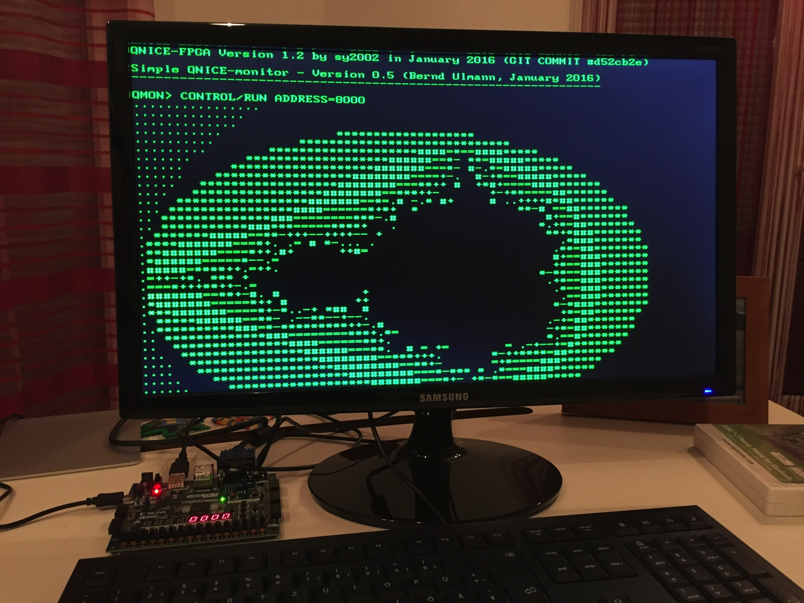

QNICE-FPGA is a 16-bit computer system built as a fully-fledged
System-on-a-Chip in portable VHDL on a FPGA. Everything - from the hardware
design in VHDL to the toolchain (assembler and C) is Open Source, so you can
start hacking right away.

Specifications
--------------

* 16-bit QNICE CPU featuring 16 registers, 8 of them in 256 register banks
* 32k words ROM (64kB)
* 32k words RAM (64kB)
* UART 115,200 baud, 8-N-1, CTS
* VGA 80x40 character textmode display (640x480 resolution)
* PS/2 keyboard support
* SD Card and FAT32 support
* 4-digit 7-segment display
* 16 hardware toggle switches

Getting Started
---------------

 * Before diving into the details, you might want to get an overview of how the system looks and feels by
   trying our [online emulator](http://qnice-fpga.com/emulator.html).
   
 * Currently, we are developing QNICE-FPGA using a
   [Nexys 4 DDR](https://store.digilentinc.com/nexys-4-ddr-artix-7-fpga-trainer-board-recommended-for-ece-curriculum/)
   FPGA development board. Nexys updated and renamed it to
   [Nexys A7](https://store.digilentinc.com/nexys-a7-fpga-trainer-board-recommended-for-ece-curriculum/).
   We recommend using either the old Nexys 4 DDR board or the new Nexys A7 board,
   too, since this will greatly speed up things for you.

 * You need a Bash Shell and GCC or CC to work with our toolchain. macOS and
   Linux work out of the box. On Windows, you might want to install the Ubuntu
   Bash on Windows 10, or work with MinGW.

 * If you are using a Nexys 4 DDR, you are ready to go with the
   pre-synthesized Bitstream that is part of our GitHub repository.

 * If you would like to synthesize the hardware by yourself, then we recommend
   using the free Xilinx [ISE WebPACK](https://www.xilinx.com/products/design-tools/ise-design-suite/ise-webpack.html),
   all necessary files to work with ISE are already part of the GitHub
   respository. As the VHDL code is written in a portable way, feel free to
   synthesize with any other tool for any other FPGA.

 * If you are using a Mac, the optimal setup is running Xilinx ISE under
   Windows in [Parallels](https://www.parallels.com/products/desktop/)
   and then working with the rest of the toolchain
   directly in the macOS Terminal. For connecting with the UART of QNICE-FPGA,
   we are recommending to use [Serial](https://www.decisivetactics.com/products/serial/).

 * A step-by-step tutorial of how to get started is available in the README.md
   of our [GitHub Repository](https://github.com/sy2002/QNICE-FPGA#getting-started),
   so [CLICK HERE TO GET STARTED](https://github.com/sy2002/QNICE-FPGA#getting-started).

Acknowledgements
----------------

* [sy2002](http://www.sy2002.de): Creator and maintainer of QNICE-FPGA:
  hardware development (VHDL), FAT32 library, additional Monitor libraries and
  functions, Q-TRIS, additional QNICE specific vbcc toolchain.

* [vaxman](http://www.vaxman.de): Inventor of the [QNICE ISA](http://qnice.sourceforge.net):
  system architect, assembler, emulator, Monitor and Monitor libraries, tools.

* [Volker Barthelmann](http://www.compilers.de): vbcc compiler system,
  QNICE specific vbcc backend incl. standard C library.
