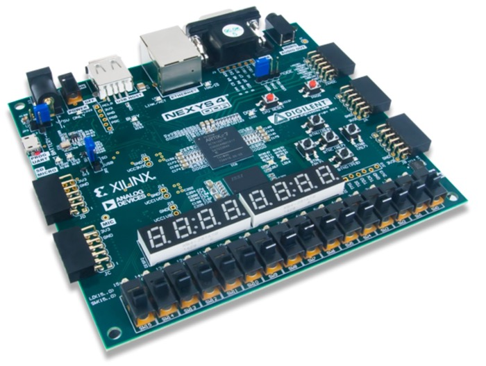

QNICE-FPGA is a 16-bit computer system built as a fully-fledged
System-on-a-Chip in portable VHDL on an FPGA. Everything - from the hardware
design in VHDL to the toolchain (assembler and C) is Open Source, so you can
start hacking right away.

Specifications
--------------

* 16-bit QNICE CPU featuring 16 registers, 8 of them in 256 register banks
  (learn more in [qnice_intro.pdf](https://github.com/sy2002/QNICE-FPGA/blob/master/doc/intro/qnice_intro.pdf))
* 32k words ROM (64kB)
* 32k words RAM (64kB)
* UART 115,200 baud, 8-N-1, CTS
* VGA 80x40 character textmode display (640x480 resolution)
* PS/2 keyboard support (mapped to USB on the Nexys 4 DDR)
* SD Card and FAT32 support (microSD card on the Nexys 4 DDR)
* 4-digit 7-segment display
* 16 hardware toggle switches

Platforms
---------

Due to the portable nature of the way this project has been developed,
QNICE-FPGA is able to run on any sufficiently powerful FPGA platform.
Additionally, there is an
[emulator](https://github.com/sy2002/QNICE-FPGA/blob/master/emulator/README.md)
available for macOS, Linux and
[WebGL](https://qnice-fpga.com/emulator.html).

Out of the box, the project contains support for the
[Nexys4 DDR and Nexys A7](https://github.com/sy2002/QNICE-FPGA/tree/master/hw#nexys-4-ddr-and-nexys-a7)
development boards as well as for the
[MEGA65](https://github.com/sy2002/QNICE-FPGA/tree/master/hw#mega65).

| Nexys4 DDR  and Nexys A7 | MEGA65                                      |
|-----------------------------|---------------------------------------------|
|||

Getting Started
---------------

 * Before diving into the details, you might want to get an overview of how
   the system looks and feels by trying our
   [online emulator](https://qnice-fpga.com/emulator.html).
   
 * Currently, we are developing QNICE-FPGA using a
   [Nexys 4 DDR](https://store.digilentinc.com/nexys-4-ddr-artix-7-fpga-trainer-board-recommended-for-ece-curriculum/)
   FPGA development board. Nexys updated and renamed it to
   [Nexys A7](https://store.digilentinc.com/nexys-a7-fpga-trainer-board-recommended-for-ece-curriculum/).
   We recommend using either the old Nexys 4 DDR board or the new Nexys A7
   board, too, since this will greatly speed up things for you.

 * You need a Bash Shell and GCC or CC to work with our toolchain. macOS and
   Linux work out of the box. On Windows, you might want to install the Ubuntu
   Bash on Windows 10, or work with MinGW.

 * If you are using a Nexys 4 DDR, you are ready to go with the
   pre-synthesized Bitstream that is part of our GitHub repository.

 * If you do not own a Nexys 4 DDR or A7 board or if you want to synthesize
   the FPGA configuration bitstream by yourself, then go to the hardware
   folder `hw` in our GitHub respository. It contains the FPGA, board and
   toolchain (IDE) specific files. QNICE-FPGA has been designed to be
   portable. Have a look at [hw/README.md](https://github.com/sy2002/QNICE-FPGA/blob/master/hw/README.md)
   to learn more.

 * If you are using a Mac, the optimal setup is running Xilinx ISE or Vivado
   Windows or Linux in
   [Parallels](https://www.parallels.com/products/desktop/)
   and then working with the rest of the toolchain
   directly in the macOS Terminal. For connecting with the UART of QNICE-FPGA,
   we are recommending to use [Serial](https://www.decisivetactics.com/products/serial/).

 * A step-by-step tutorial of how to get started is available in the README.md
   of our [GitHub Repository](https://github.com/sy2002/QNICE-FPGA#getting-started),
   so [CLICK HERE TO GET STARTED](https://github.com/sy2002/QNICE-FPGA#getting-started).

Acknowledgements
----------------

* [sy2002](http://www.sy2002.de): Creator and maintainer of QNICE-FPGA:
  hardware development (VHDL), FAT32 library, additional Monitor libraries and
  functions, Q-TRIS, additional QNICE specific vbcc toolchain,
  VGA and WebAssembly versions of the emulator, MEGA65 port.

* [vaxman](http://www.vaxman.de): Inventor of the
  [QNICE ISA](http://qnice.sourceforge.net):
  system architect, assembler, original POSIX version of the emulator,
  Monitor and Monitor libraries, tools.

* [Volker Barthelmann](http://www.compilers.de): vbcc compiler system,
  QNICE specific vbcc backend incl. standard C library.

* [MJoergen](http://www.github.com/MJoergen): Performance improvements and
  bugfixes, CPU functional test suite.
