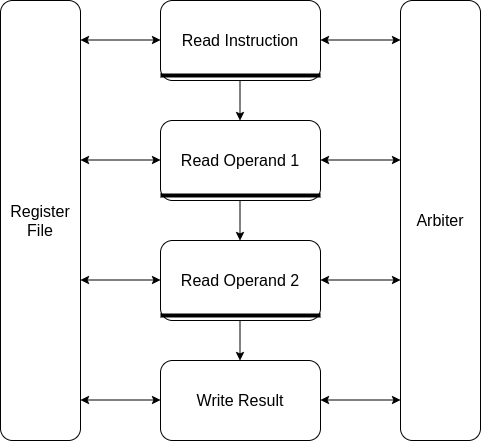
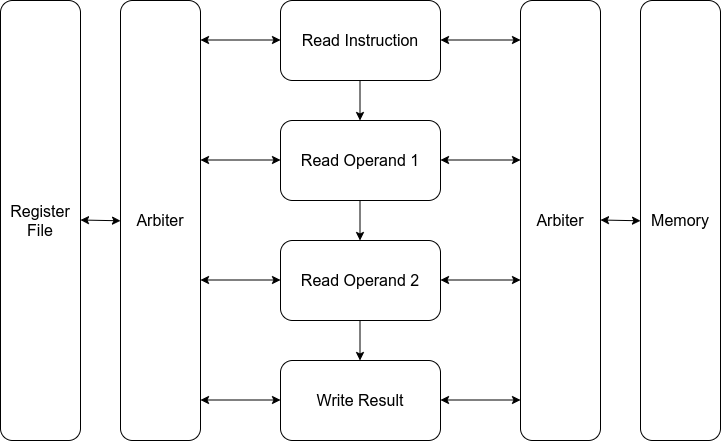

# Design of a new *pipelined* CPU

When designing a new pipelined version of the QNICE CPU, there is a elephant in
the room: An instruction such as `ADD @R0, @R1`, which itself is only a single
word in memory, will require four memory access: Reading the instruction,
reading from @R0, reading from @R1, and finally writing to @R1.  Since the
system bus in the QNICE only allows for a single memory access at a time, this
instruction must consume (at least) four clock cycles.

The design currently being worked on bases the pipelined approach on the above
observation: In each clock cycle the instruction proceeds from one stage to the next,
where each stage handles a single memory access. In other words, the first design
will have a four-stage pipeline:

* Stage 1: Read instruction
* Stage 2: Read operand 1
* Stage 3: Read operand 2
* Stage 4: Write result

Each of the above stages will have a memory interface (address and data)
feeding into a central arbiter. The purpose of the arbiter is to allow only a
single stage at a time access to the memory.

The four stages must be prioritized in some way. Presumably, priority should be
given to the highest numbered stage, so that the pipeline can be emptied as
quickly as possible. This priority scheme is still TBD.

The four stages also interact with the register file.

The current QNICE design allows combinatorial reads from both the register file
and from memory. Here memory read is synchronous to the falling clock edge, so
appears combinatorial from the CPU's perspective. We will probably later on
insert flip-flops when reading from register file and/or memory, in order to
reduce the long combinatorial paths and thereby increase the clock frequency.
However, in order to keep the design as simple as possible, this is deferred to
later.

So far, the design looks as follows:



The important design decisions are as follows:
* There are four stages.
* Each stage receives input in the same clock cycle as providing the output.

In other words, the horizontal connections are combinatorial. The vertical
connections are registered. The registering is depicted with the thick
horizontal bars where the connections originate from.

Important constants (e.g. instruction decoding) is placed in the package file
`cpu_constants.vhd`.

## Pipeline flow and back pressure
Data usually flows from one stage to the next on every clock cycle. However, sometimes
a stage does not have data to deliver to the next stage. This creates an idle
cycle, and must be signalled in some way. Here we use the signal `valid` to
indicate if the next stage should do some work or just skip this clock cycle.

Similarly, the arbiter may grant or deny access to the external memory. In
other words, if - say - `Read Operand 2` and `Write Result` both want to access
memory, only `Write Result` will be granted access. In the mean time, the stage
`Read Operand 2` must wait until it is granted access. This stalls the entire
pipeline all the way back to the start, because no stage before `Read Operand
2` may proceed. This stalling is indicated by the signal `ready`, which is
deasserted when a stage is not able to accept new data.

## Testing
I'm simultaneously testing the design in simulation and in hardware. I've
therefore written a top-level entity `top.vhd` that instantiates the pipelined
CPU as well as a small memory. This small memory acts as a RAM, and is
initialized with some instructions. In others words, the memory provides
instructions for the CPU as well as acting as writeable memory while the
instructions are being executed.

In order for the synthesis to not reduce away all the logic, I've connected the
PC register to the LED outputs.

I've written a small simulation testbench that instantiates this top level
entity and provides clock and reset.

### Test methodology
So the test methodology is to write one or more small assembly programs and
place them in a file e.g. `test1.asm`. Then to start the test simply type:

```
make test1
```

This will assemble the file `test1.asm` into binary data in the file
`prog.rom`, which is used to initialize the memory. Then the PC is reset
(currently to 0x0010), and the CPU starts executing!

Verification is done by manually inspecting the generated waveform.

## Arbiter and pipeline

In the following we'll analyze the dynamics of the pipeline and the
arbitration for the memory in a few different cases.

### `MOVE @R, R`

First we will consider a sequence of instructions of the same instruction,
namely `MOVE @R, R`. To execute this instrution, the CPU needs to perform an
instruction fetch, as well as reading the source operand.  In other words, the
stages `Read Inst` and `Read Source` will be performing memory accesses, while
the stages `Read Dest` and `Write Result` will not.

The following table shows each stage as a row, and with time progressing to the
right. As an instruction propagates through the pipeline, it will travel
diagonally down to the right. If an instruction is shown with small letters,
then that means the instruction is not performing any memory access in that
particular clock cycle. In other words, in each column at most one row may
perform a memory access.

```
Read Inst    | MOVE @R,R0 | .......... | MOVE @R,R1 | .......... | MOVE @R,R2 | .......... |
Read Source  | .......... | MOVE @R,R0 | .......... | MOVE @R,R1 | .......... | MOVE @R,R2 |
Read Dest    | .......... | .......... | move @r,r0 | .......... | move @r,r1 | .......... |
Write Result | .......... | .......... | .......... | move @r,r0 | .......... | move @r,r1 |
```

The table shows how "Read Source" takes precedence over "Read Inst". So at the
second time step, no instruction fetch is taking place while the CPU is reading
the source operand from @R.

The table also shows that the memory bus is active on all clock cycles, and a
new instruction starts every two clock cycles.

### `MOVE R, @R`
Next we will consider a seemingly similar looking sequence, this time with the
instruction `MOVE R, @R`. This instruction will access memory three times:
`Read Inst`, `Read Dest`, and `Write Result`. The dynamics is now somewhat more complicated,
as shown in the following:

```
Read Inst    | MOVE R,@R0 | MOVE R,@R1 | .......... | .......... | .......... | .......... | MOVE R,@R2
Read Source  | .......... | move r,@r0 | move r,@r1 | .......... | .......... | .......... | ..........
Read Dest    | .......... | .......... | MOVE R,@R0 | .......... | MOVE R,@R1 | .......... | ..........
Write Result | .......... | .......... | .......... | MOVE R,@R0 | .......... | MOVE R,@R1 | ..........
```

We see how it now takes six clock cycles to perform two instructions, and that
the memory system is active on every clock cycle.

One may argue that the MOVE instruction does not need to read the destination
operand. That is entirely true, but the above dynamics still apply to
instructions like `ADD R, @R`. To put it differently, the instruction `MOVE R,
@R` can be optimized by having it not read the destination operand. This is
still TBD.

### Register file access
In the current design, there are three simultaneous writes to the CPU registers:

* In the `Read Source` stage in case of pre-decrement or post-increment.
* In the `Read Dest` stage in case of pre-decrement or post-increment.
* In the `Write Result` stage when the destination is a register.

However, any given instruction only updates at most two CPU registers. So does
the register file really need three write ports? This quesion is important,
because the synthesis tool only allows one write port for RAM blocks, when
they are combined with multiple read ports.

Consider the following sequence of instructions:
```
ADD R0, R1        (update register R1 in stage 4)
ADD R2, @R3++     (update register R3 in stage 3)
ADD @R4++, R5     (update register R4 in stage 2 and register R5 in stage 4)
```

The table below shows register file updates (indicated with the instruction
written in upper case letters):

```
1. Read Inst    | add r0, r1    | add r2, @r3++ | add @r4++, r5 | ............. | ............. | .............
2. Read Source  | ............. | add r0, r1    | add r2, @r3++ | ADD @R4++, R5 | ............. | .............
3. Read Dest    | ............. | ............. | add r0, r1    | ADD R2, @R3++ | add @r4++, r5 | .............
4. Write Result | ............. | ............. | ............. | ADD R0, R1    | add r2, @r3++ | ADD @R4++, R5
```

It is seen that in the fourth clock cycle, three different pipeline stages all
want to write to the register file simultaneously.

However, in this specific combination of instructions the third instruction
will be stalled due to the memory arbiter.

So this analysis shows that the register file needs three write ports, but most
of the time, not all three writes will be active at any given time.  In other
words, we need another arbiter, this time for the register access!  This is
necessary, in order to be able to implement the register file using RAM blocks
in the FPGA.

### Redesign
So this calls for another iteration of the design.  The previous arbiter is now
renamed to `arbiter_mem.vhd` and a new `arbiter_regs.vhd` is added. The
register arbiter allows only a single stage to write to the register file at a
given time.  In the figure below is shown the new arbiter placed in between the
processing stages and the register file.



Crucial for this redesign is that the register arbiter provides a ready signal
to each stage, indicating whether that stage is allowed access. So now each
stage must wait for three conditions:

* Access to register write
* Access to memory
* Access to next stage

Only when all three conditions are met simultaneously may the stage proceed
with its processing.  Otherwise it must wait until the next clock cycle, thus
stalling the entire pipeline. However, this extra register arbiter doesn't seem
to lead to major pipeline stalling in practice. A close analysis will follow
later (TBD).

The implementation of the register arbiter is similar to the memory arbiter,
but with only three "clients" it becomes slightly simpler. Just like with the
memory arbiter priority is given to the later stages. This decision too is TBD,
but initially it is believed to help proving that the pipeline never locks up,
i.e.  where multiple stages are waiting for each other, and no stages are
proceeding.

It should be noted that updating of the PC and the SR is handled separately.
The register arbiter only handles regular register updates.

## Implementation in hardware
Since the design is becoming more complex, it is necessary that the memory
block is implemented using RAM blocks in the FPGA. This requires a synchronous
read.  So far, our design expects a combinatorial read from the memory, but
this can be achieved by clocking the memory on the **falling** clock edge. So
the memory performs a synchronous read, but the CPU still has the remaining
half of the clock cycle to process the data.

Adding this change to the design leads to timing violations when running at 100
Mhz.  So now we see that all these combinatorial connections lead to large
timing paths (as expected) and reduces the maximum frequency. Therefore, a
clock module is added in `top.vhd` to generate a slower clock. Later, we might
look into how we can increase the clock frequency e.g. by introducing more
pipeline stages. Currently, the clock is running at 65 MHz.

Simlulating a clock module is very slow, so to avoid that I've connected the
CPU and memory in a `system.vhd` file which can be used for simulation. This
module is then instantiated in the top level file.

The current resource utilization in the FPGA are as follows:

* Slice LUTs : 354
* Slice Registers : 111
* Slices : 107

This shows the CPU uses very few resources indeed. But the ALU is not fully
implemented yet, and neither is register banking.

Here is a short TODO list for the next few steps:
* Finish the ALU, including generating the correct value for `SR`.
* Optimize the `MOVE R, @R` instruction so that it does not read from `@R`, since
  that value is not used.
* Make sure instructions like `MOVE @R15++, R` work, so that we can load
  immediate values into registers.
* And then finally conditional branching, so that we can start writing
  self-verifying test cases.

## Optimizing `MOVE R, @R`
It seems that the memory interface is a saturated interface, meaning that on
every clock cycle the CPU is either reading from or writing to memory. It
therefore makes sense to optimize instructions, so they only spend memory
bandwidth if it is really needed.

Some instruction, e.g. MOVE, SWAP, and NOT, do not read the old value of the
destination. Therefore, they can be optimized by not requesting a memory
access. To simplify the design I've introduced a new signal `mem_request`
in the file `read_dst_operand.vhd`. The same signal has been introduced into
the other pipeline stages as well, just for consistency.

Since the `MOVE R, @R` instruction now only accesses the memory twice,
the memory arbitration dynamics are much different,
as shown in the following:

```
Read Inst    | MOVE R,@R0 | MOVE R,@R1 | MOVE R,@R2 | .......... | .......... | .......... | MOVE R,@R3
Read Source  | .......... | move r,@r0 | move r,@r1 | move r,@r2 | .......... | .......... | ..........
Read Dest    | .......... | .......... | move r,@r0 | move r,@r1 | move r,@r2 | .......... | ..........
Write Result | .......... | .......... | .......... | MOVE R,@R0 | MOVE R,@R1 | MOVE R,@R2 | ..........
```

## Finalizing the ALU

The ALU is a large combinatorial module, including two barrel shifters
(shifting a variable amount). It therefore makes sense to complete this module,
to see how it influences the resource count and timing.

It turns out the timing is unaffected. The resource utilization has
approximately doubled to:

* Slice LUTs : 601
* Slice Registers : 116
* Slices : 175

