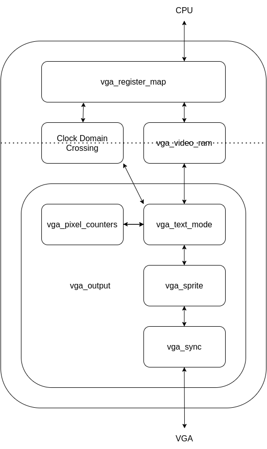

# VGA Multicolor Design

This file contains a brief description of the design of the VGA
module.

## Block Diagram

The VGA Multicolor block connects directly to the CPU and to the VGA output
port on the FPGA. The following is a block diagram:

Since the CPU runs at 50 MHz and the VGA output port runs at 25 MHz we have two
different clock domains. To avoid timing problems it is convenient to split the
VGA multicolor module into separate blocks each using only a single clock
signal. This separation between clock domains is marked in the diagram above by
the dotted line.

The file [vga_multicolor.vhd](vga_multicolor.vhd) therefore instantiates three
blocks:
* `vga_register_map`
* `vga_output`
* `vga_video_ram`

The first block (`vga_register_map`) connects to the CPU using only the CPU
clock domain (50 MHz), and the second block (`vga_output`) connects to the VGA
output port using only the VGA clock domain (25 MHz). Only the last block
(`vga_video_ram`) uses both clock domains. Furthermore, the block named "Clock
Domain Crossing" is responsible for copying the configuration and status
signals between the two clock domains.

Each of these blocks will be described below:

## `vga_register_map`
This entire block works solely in the CPU clock domain.

The core of this block is the signal `register_map` that contains the 24
registers (`0xFF30` - `0xFF47`) accessible by the CPU.

The output signals from this block are divided into two groups: One group
writes to and reads from the Video RAM and the other group provides
configuration signals directly to the `vga_output` block through the "Clock
Domain Crossing".

## `vga_output`
This block receives configuration signals from the `vga_register_map` block
(via "Clock Domain Crossing") as well as reads from the four parts of the Video
RAM (Display RAM, Font RAM, Palette RAM, and Sprite RAM). From these, this
block generates the VGA output signals.  This block consists of these four sub
blocks:
* `vga_pixel_counters`
* `vga_text_mode`
* `vga_sprite`
* `vga_sync`

These blocks will be described in the following:

### `vga_pixel_counters`
This small block generates the X and Y pixel coordinates in the intervals 0-799
and 0-524, as well as a frame counter in the interval 0-59. The counters wrap
around after exactly one second. The frame counter is used to control the
blinking cursor.

### `vga_text_mode`
This block receives the configuration signals from the `vga_register_map` and
the pixel counters from the block `vga_pixel_counters` and it reads data from
the Display RAM, the Font RAM, and the Palette RAM. It then generates an output
stream of pixel colors in RGB format.

The operation is divided into three steps:
1.  First it reads a single word from the Display RAM, where the address is
calculated from the current pixel coordinates.
2. Then it reads a single word from the Font RAM, where the address is calculated
from the value read from the Display RAM.
3. Finally it reads a single word from the Palette RAM, where the adress is
calculated from the values read from the Font RAM and the Display RAM.

### `vga_sprite`
This is the most complicated part of the design. The description of this block
is left to the end of this document.

### `vga_sync`
This small module generates the Horizontal and Vertical synchronization signals
needed for the VGA output. Furthermore, it blanks the screen (i.e. sets the
color output to black), when the current pixel is outside the screen area.

## `vga_video_ram`
This block makes use of True Dual Port (TDP) memory, which is a builtin part of
the FPGA. This is regular RAM with two completely independent ports, each with
their own address and data signals and even clock signals.

This block actually instantiates the block `true_dual_port_ram` six times,
one for each of:
* Display RAM  (64k words, corresponding to 20 screens of text)
* Font RAM     (8k words, corresponding to two sets of 8x12 font bitmaps)
* Palette RAM  (64 words, corresponding to two sets of 16-color palettes)
* Sprite Config RAM (4 words for each sprite)
* Sprite Palette RAM (16 words for each sprite)
* Sprite Bitmap RAM (32k words in total)

----------------------------------------------------------

## `vga_sprite`
We now end this document by returning to the most complicated part of the
design.  The `vga_sprite` block works by completely rendering an entire
horizontal scanline, and then storing it in memory until it is to be displayed.

This block operates on a strict pixel budget as follows, where the pixel
numbers indicate the horizontal number of the currently displayed pixel.
* Pixels 0 to 639 : Read from a previously rendered scanline.
* Pixels 640 to 659 : Clear the next scanline (32 pixels at a time).
* Pixels 660 to 671 : Idle
* Pixels 672 to 799 : Render next scanline (one sprite at a time).

The scanline is stored as a RAM containing the 15-bit RGB color information
for each of the 640 pixels. However, the scanline is accessed 32 pixels at a
time; this is determined by the maximum width of a sprite.

### Rendering
The rendering process works in a pipelined fashion, where a new sprite is being
processed on every clock cycle. The processing is broken down into a number of
separate stages:
1. First read the configuration and palette (this gives the bitmap pointer and
   the sprite coordinates).
2. Use the sprite y-coordinate to read the corresponding row of 32 pixels from
   the bitmap memory. Then use the palette to translate all color indices to
   15-bit RGB color.
3. Store the row of 32 pixels into the scanline memory.

### Scanline memory
This block is implemented in the file `vga_scanline.vhd`.  The input to this
block is simply a data bus of 32 pixels and an address bus indicating the pixel
number. It allows writing a block of 32 pixels.  The tricky part is that the
address is allowed to be un-aligned, i.e.  not a multiple of 32 pixels.

Internally, the memory is organized as blocks of 32 pixels. Due to the
un-aligned accesses it is necessary to do a partial write to two consecutive
blocks. This is implemented using byte-enables, which is a built-in feature of
the Xilinx BRAMs.

The scanline memory uses 16 BRAMs. This seems way too much since the amount of
information is only 640\*16 bits, which easily fits inside a single BRAM.
However, a single BRAM only supports 4 byte-enable signals, but we need 32, one
for each pixel.  More importantly though, since we are reading a block of 32
pixels at a time we require a data bus of 32\*16 = 512 bits, and each BRAM
only has a 32 bit data bus.

